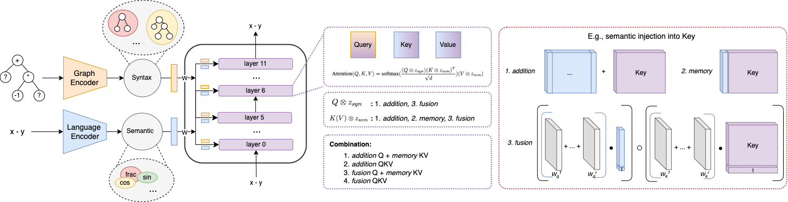

Implementation of work "Graph-induced Syntax Injection in Variational AutoEncoders"

***


running encoding baselines:

1. train_optimus_disentangle_graph.py
2. train(evaluate)_optimus_disentangle_lstm.py
3. train(evaluate)_optimus_disentangle_siam.py
4. train(evaluate)_optimus_separate_graph.py
***



running decoding baselines:

1. train(evaluate)_optimus_separate_graph_syntax_constraint_gpt2.py

```python
fuse_way = "add_syn_Q_sem_KV"
# add_syn_Q_sem_KV
# add_syntax_query
# fuse_syntax_query
# fuse_syn_Q_sem_KV

token_level = 'subword' # 'char_add_latex_tokens_without_var' for mathematical expression, 'subword' for natural language 
graph_type = 'TransformerConv' # GAT, GCN, GraphSAGE, TransformerConv
exp = 'natural' # symbol or natural
```

running attention heatmap visualization:

1. attention_visualization_optimus(best_setup).py
***


packages:

**text_autoencoders** is modified from:

```latex
@inproceedings{shen2020educating,
  title={Educating text autoencoders: Latent representation guidance via denoising},
  author={Shen, Tianxiao and Mueller, Jonas and Barzilay, Regina and Jaakkola, Tommi},
  booktitle={International Conference on Machine Learning},
  pages={8719--8729},
  year={2020},
  organization={PMLR}
}
```
**optimus** is modified from:

```latex
@inproceedings{li2020optimus,
  title={Optimus: Organizing Sentences via Pre-trained Modeling of a Latent Space},
  author={Li, Chunyuan and Gao, Xiang and Li, Yuan and Peng, Baolin and Li, Xiujun and Zhang, Yizhe and Gao, Jianfeng},
  booktitle={Proceedings of the 2020 Conference on Empirical Methods in Natural Language Processing (EMNLP)},
  pages={4678--4699},
  year={2020}
}
```
